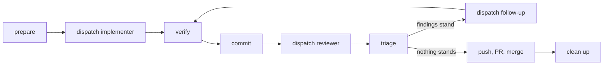

# Carry delegated work from one phase to the next

**Before starting, read your notes for this skill**, where they exist — `~/.agents/skill-notes/hand-off.md`,
then `.agents/skill-notes/hand-off.md`, then `.agents/skill-notes/hand-off.local.md`. Where two disagree, the
more specific one wins. They hold what earlier runs taught; see the last section for how they are written.

Fires at every boundary of a change that runs through subagents: before the first dispatch, each time a
subagent returns, and after the merge. At each boundary the work is in a known state — verified against
the gate, committed, and the next brief written or the worktree removed — and the report of the phase
before has been checked rather than believed.

**This is a target-state skill.** Each boundary has one correct end state, and a second run at the same
boundary repairs whatever is missing from it. `audit` runs `finished-worktrees.sh` and reports which
boundaries are open, writing nothing.

## The distinct moment this covers

Preparing a worktree, dispatching an implementer, and closing out a branch each have their own per-task
mechanics already covered elsewhere:

- **[`using-git-worktrees`](https://github.com/obra/superpowers)** — how to create and use one isolated
  worktree for a piece of work.
- **`subagent-driven-development`** — dispatching a subagent for one task and checking what it returns.
- **`requesting-code-review`/`receiving-code-review`** — asking for a review and acting on what it finds.
- **`finishing-a-development-branch`** — merging a finished branch and cleaning up after it.

Follow their per-task mechanics where they cover it. What they lack, and what this skill is for, is the
whole loop end to end, with four things none of them assume on their own:

- **The implementer never commits.** Other implementers may hold uncommitted work of their own in the
  same worktree, on other files, at the same time — so the caller verifies the diff against the gate and
  commits before the reviewer ever runs. This is a deliberate deviation from superpowers' implementer
  template, which commits its own work: here, one agent committing would risk carrying along a sibling's
  unfinished edit.
- **Several implementers, one worktree, disjoint files, in parallel.** A plan or dossier that fans out
  into several independent items dispatches one implementer per item into the same worktree, each
  restricted to the files it owns — a second deliberate deviation, this time from
  `subagent-driven-development`'s "never dispatch multiple implementation subagents in parallel": that
  rule guards against two agents racing on the same files, which disjoint write sets already rule out, and
  the caller verifies each one's diff before the next step, so nothing races on trust either.
- **The batch worktree audit.** `finished-worktrees.sh` reports every worktree's state across a whole
  repository in one pass, not one at a time.
- **The worktree `core.hooksPath` defect.** Claude Code writes `core.hooksPath` into the clone's shared
  `.git/config` when it creates a worktree (2.1.280; anthropics/claude-code issue 85039), turning a
  relative `.githooks` into the main checkout's absolute path — see Commit, below.

The work splits in two, and the split is the point of this skill:

| Deterministic — a script or a command | Judgement — the main loop, never delegated |
|---|---|
| creating the worktree and installing dependencies | the design decision an issue or a plan left open |
| rerunning the gate after the implementer | whether a review finding stands, and at what severity |
| what model, effort and turns a subagent ran on | whether a ruling the implementer made is accepted |
| which worktrees are merged, left over or dirty | what goes in the next brief |

A judgement handed to a subagent comes back as a confident report, and a determinism left to judgement
comes back as a number nobody reran.



## Prepare — a worktree exists on its own branch, with dependencies

```sh
sh ${CLAUDE_SKILL_DIR}/scripts/prepare-worktree.sh <repo> <branch> [base]
```

It fetches, branches from `origin/main` unless a base is given, installs with `npm ci` when there is a
lockfile, and prints the path. A change that builds on an unmerged branch passes that branch as `base`.
Decide the open design questions now, before any dispatch: an issue that says "to decide" is decided
here, in the main loop, and the brief carries the decision. Worktrees land at
`<repo>/.claude/worktrees/<branch>` — unlike superpowers' `using-git-worktrees`, which uses
`.worktrees/<name>` at the repository root.

## Dispatch the implementer — the brief carries only what varies

Any implementer subagent works; `delegation:implementer` is this catalog's own, and is the optional agent
to dispatch where you have it. Without a subagent tool, do the phase yourself, in the main loop. Where the
repository has an implementer definition, the brief is its variable half: which variant
(language), the worktree path, the items owned, the decisions taken, what siblings are touching. The
definition carries the rest. The brief names a dossier — a task note beside the plan, or, in a repository
under `project/tasks/NNN-slug.md`, that file — holding the decisions and the files each item owns, so a
compacted context loses nothing the dispatch depended on. If you have the `vibe-ops:new` skill, `/vibe-ops:new
task` is an optional richer backend for that dossier; a plain file the caller writes works the same way.
When siblings run from the same dossier, the brief says so: each reports its rulings and questions, and
only you write them into the dossier. **Omit `model` on the call** — a per-call model overrides
the definition — except for two reasons: to escalate after a gate failure, or because a row of your
routing table starts this kind of work on a stronger model already (a cross-cutting change routed straight
to `opus`, say). Two implementers run in parallel only when their write sets are disjoint; the same file
goes to one agent.

## Verify — the report is a claim until the gate says otherwise

When the implementer returns:

1. Read `git -C <worktree> diff --stat`, then the diff itself. Look for a file outside the brief's write
   set, and for a comment or document the change made wrong.
2. Rerun the gate yourself, one command per call, and compare the counts with the report.
3. Check what ran: if you have the `delegation:route-work` skill, `node <route-work skill
   dir>/scripts/measure.js --root <dir> --days 1` reports per kind of delegation — the model asked for and
   the one that ran, with counts, tokens and wall time — not per subagent, and it carries no turns (also
   `--projects`, `--since`, `--until`, `--scope`, `--format table|artifact`, `--out`; there is no
   `--agents` flag). For one subagent's own exact model, effort and turns, read its transcript: a model
   other than the definition's means a `model` was passed on the call. An IDE panel can show a different
   label; the transcript is what ran.
4. Rule on each `Ruling:` line of the report: accept it, or reverse it in the next brief. Copy the
   accepted ones, and the questions, into the dossier when siblings shared it; questions for the
   maintainer go into the plan's open questions, asked in one batch.
5. Judge the delegation once these four are settled: record the verified result with `/route-work record
   <what happened>` (`/delegation:route-work record <what happened>` in a full plugin install) — one row
   per verified delegation, held or not; an unverified one is recorded as `?`. A reviewer is judged at the
   end of Triage, on whether its findings reproduced.

Fix a small wording error yourself; send anything that needs the gate back through a follow-up.

## Commit — before the reviewer, on the branch you chose

Stage by name, check `git branch --show-current` immediately before committing, and commit through the
repository's own hook. **Commit before dispatching a reviewer that runs in an isolated worktree**: it
starts from the default branch and sees commits, never another worktree's uncommitted files.

**After any isolated subagent or `EnterWorktree` has run in this clone, check which hook will judge the
commit**: `git config --show-origin core.hooksPath`. Claude Code writes `core.hooksPath` into the clone's
shared `.git/config` when it creates a worktree (2.1.280; anthropics/claude-code issue 85039), turning a
relative `.githooks` into the main checkout's absolute path. Every worktree then commits through `main`'s
hook, so a branch that changes the hook is judged by the old one and nothing says so. Set it back with
`git config core.hooksPath .githooks` once the isolated worktree is gone.

## Dispatch the reviewer — a range and the risks to examine first

Any reviewer subagent works; `delegation:reviewer` is this catalog's own, and is the optional agent to
dispatch where you have it. Without a subagent tool, do the review yourself. The brief is the range
(`<base>..<head>`), the issue or plan it implements, the design decisions taken (so the reviewer judges
the implementation against them, and the design only for a reason they did not weigh), and the risks to
examine first. Omit `model` here too, for the same two reasons as the implementer.

## Triage — each finding stands or falls here

Reproduce each finding before accepting it; a finding with its probe attached usually takes one command.
Decide its severity by its effect on whoever uses the result, not by the label the reviewer gave it.
Findings that stand become the follow-up brief, stated as decisions — the implementer reproduces and
fixes, and does not re-argue. A design finding that reverses a decision you took is yours to accept
openly, and the pull request says so.

Nothing stands: go to push. Something stands: dispatch the follow-up, then **Verify** again.

## Push, open the pull request, merge

Push the branch, open the pull request with what changed, why, and how it was checked (the gates and
their counts, the review and what it found), using `gh` if it is on your PATH. Without `gh`, this step
degrades to the URL the forge prints when the branch is pushed: open it and fill in the same content by
hand. Write it for the repository's readers: a public repository gets no workspace name and no machine
path.

## Clean up — after the merge, nothing is left behind

```sh
bash ${CLAUDE_SKILL_DIR}/scripts/finished-worktrees.sh <repo>
```

It prints each worktree as `merged` (every commit is on the default branch already), `leftover` (a
`worktree-agent-*` branch, or a detached HEAD, with nothing the default branch or a remote-tracking branch
lacks), `detached-unpushed` (a detached HEAD holding a commit nothing else contains), `dirty` (uncommitted
or untracked files), `unreadable` (`git status` itself failed there — a missing directory, a permissions
problem) or `open` (still in flight), and removes nothing. **Only `merged` and `leftover` are ever safe to
remove** — never `open`, `dirty`, `detached-unpushed` or `unreadable`. Fast-forward the main checkout
(`git pull --ff-only`), then for each `merged` or `leftover` worktree: `git worktree remove`, then `git
branch -d` (never `-D`) — git's own refusal to delete an unmerged branch is the last guard, and forcing
past it defeats the whole classification above. Look inside a `dirty`, `detached-unpushed` or
`unreadable` one before touching it. A newly merged definition or skill loads in the next session, not in
the current one.

When an escalation fired, the delegation that failed and the one escalated to are judged each on its own
result: the pair is the measurement the routing row lacks.

## Checklist

- [ ] The open design decisions were taken in the main loop before the first dispatch
- [ ] Each brief carried only the variable half, and no call passed `model` except an escalation or a
      routing-table row that starts this kind of work on a stronger model
- [ ] After each implementer: the diff was read, the gate rerun, and what ran was confirmed
- [ ] Every `Ruling:` was accepted or reversed
- [ ] The commit preceded the reviewer's dispatch
- [ ] Every review finding was reproduced before it went into a follow-up brief
- [ ] After the merge, `finished-worktrees.sh` shows no `merged` or `leftover` line

## ⟳ After every use: note what this run taught

**Never edit this file** — it is an installed copy, and the next update overwrites it without a word.
Write what the run taught to a notes file instead, one dated line per point, in the narrowest scope that
fits:

- **local** — `.agents/skill-notes/hand-off.local.md`, kept out of git (add `*.local.md` to that folder's
  ignore rules if it is not there yet). The default.
- **repo** — `.agents/skill-notes/hand-off.md`, committed, read by everyone who works in this repository.
- **user** — `~/.agents/skill-notes/hand-off.md`, true for you in every project.

Then ask the user whether a note should go back into the skill itself, through the flow they use for it
— an issue, a pull request, an edit in the plugin's own repository. When you do not know that flow, ask.

What is worth noting, in this skill:

- The weakest boundary is Verify: a green gate the implementer reported and nobody reran reads the same
  as one that was rerun. Note it when the counts were not actually compared.
- `finished-worktrees.sh` detects a merge by commit ancestry, so a squash-merged branch reads as `open`.
  Note the repository and whether a second signal (the pull request's own state, from `gh`) was needed.
- A `core.hooksPath` surprise: which command exposed it, and whether resetting it before the next commit
  was enough.

Verified against: Claude Code 2.1.282 (VS Code extension), `git` worktrees, `gh` CLI, 2026-09-26.
